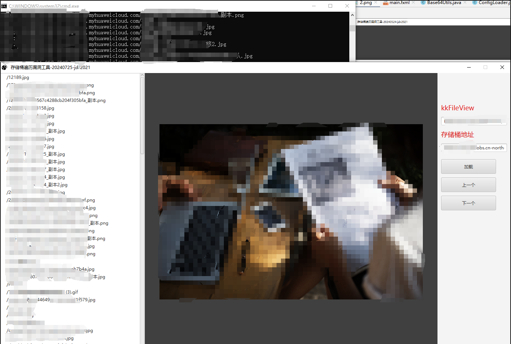
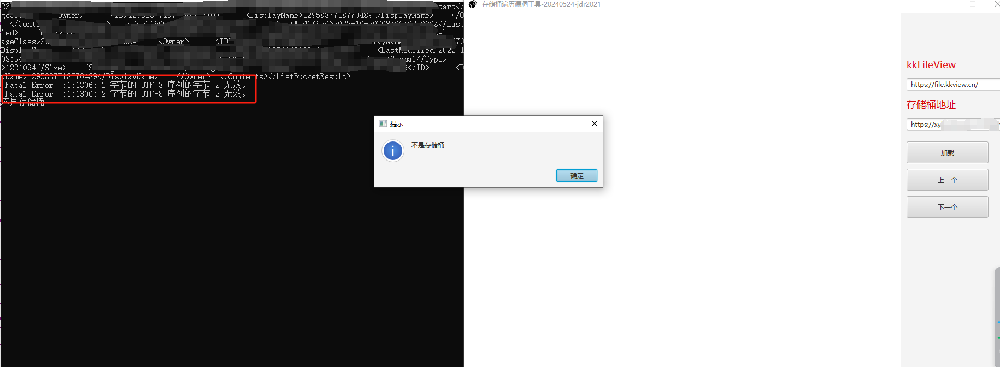
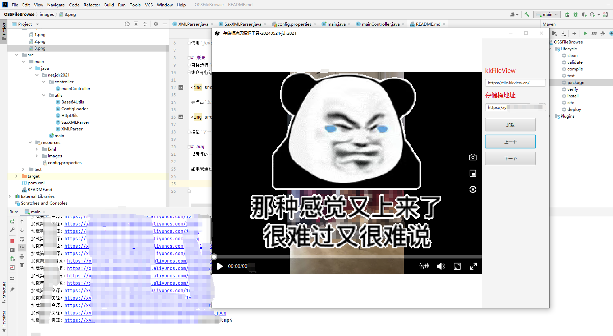
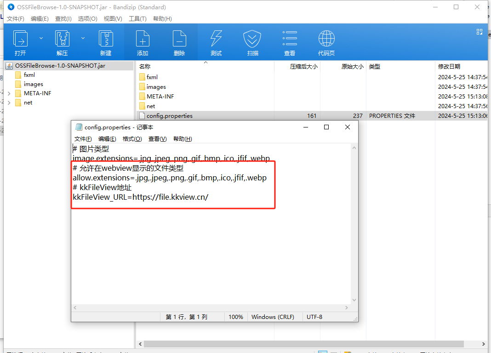

# 简介

由于经常遇到存储桶遍历漏洞，直接访问文件是下载，不方便预览，且甲方要求证明该存储桶的危害，因此该工具应运而生。

# 技术
使用`javafx`做图形化，`kkFileView`做文件预览接口。

# 使用
直接运行`OSSFileBrowse-1.0-SNAPSHOT.jar`、
或命令行运行`java -jar OSSFileBrowse-1.0-SNAPSHOT.jar`

先点击`加载`按钮，此时会爬取存储桶上的全部资源，等待几秒后，左边的`webView`将会通过`kkFilewView`去渲染文件资源。

按钮`下一个`将会切换到下一个存储桶资源、按钮`上一个`将会返回到上一个资源。

# bug
很奇怪的一个bug，如果idea直接运行`OSSFileBrowse`，爬取某个存储桶上的文件是正常的。

如果我通过`maven`打包成jar之后，再去跑该存储桶，将会爬不到数据。

我太菜了，解决不了。感觉是编码问题。

# 注意
在`config.properties`中

修改`allow.extensions`的值，即可添加可支持的文件类型进行预览。

修改`kkFileView_URL`的值，即可将`kkFileView`修改成自己的kkfileview。
默认是使用官方的`kkfileview`地址。

# 最后

如果该项目对你有帮助，给一个小小的`star`吧。
