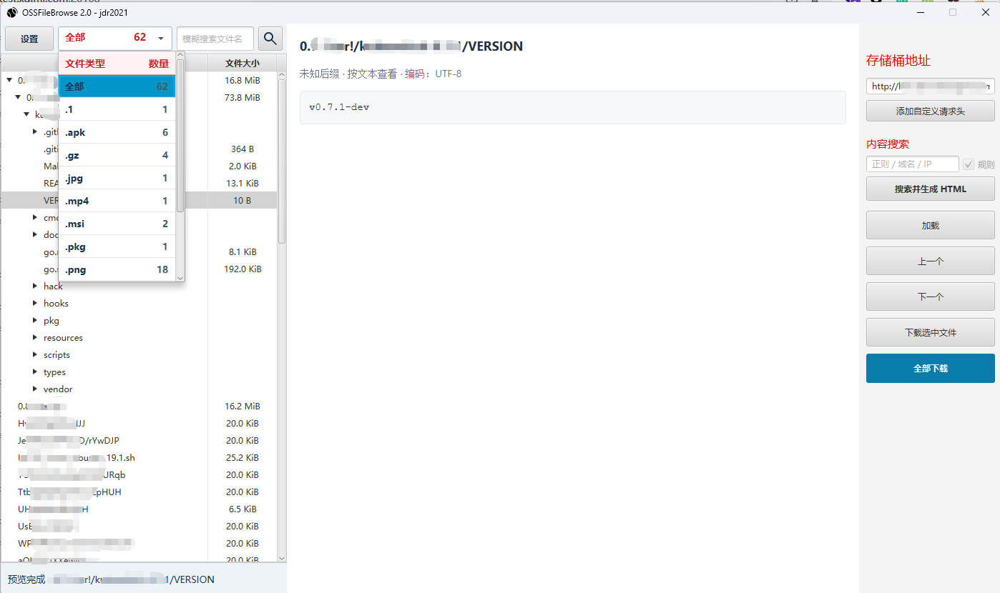

# 简介

由于经常遇到存储桶遍历漏洞，直接访问文件是下载，不方便预览，且甲方要求证明该存储桶的危害，因此该工具应运而生。

# 更新日志
## 2026.07.24 v2.0版本

1. 优化界面布局；

2. 新增内容敏感字段搜索，规则来源于 HaE 的 [Rules.yml](https://github.com/overspace-labs/HaENet/blob/main/sources/src/main/resources/rules/Rules.yml)；

3. 修复中文场景下必须添加 `-Dfile.encoding=UTF-8` 参数启动的问题；

4. 新增自定义请求头功能，详见 [Issue #7](https://github.com/jdr2021/OSSFileBrowse/issues/7)；

5. 新增文件排序、文件大小排序、文件名模糊搜索和文件后缀筛选；

6. 移除对kkfileview的强制依赖，内置支持 PDF、DOC/DOCX、XLS/XLSX、PPT/PPTX、文本、图片、HTML 和音视频远程预览；

7. 支持 ZIP、JAR、TAR、7z、RAR、GZIP 按目录层级展开，并支持多层嵌套压缩包继续展开和预览；

8. 优化存储桶文件列表加载，单次解析响应中的全部 `<Contents><Key>`，并将文件列表缓存在内存中，筛选、搜索和排序无需重复请求；

9. 新增本机 HTTP 代理预览，支持 `HEAD`、`Range` 和 `206 Partial Content`，远程文件可直接流式预览；

10. 新增 JavaCV/FFmpeg 音视频播放器，采用后台解码方式减少界面卡顿，并保留 JavaFX Media 兼容播放机制；

11. 新增设置面板，支持配置 FFmpeg 路径和 kkFileView；首次运行时在当前工作目录生成 `config.properties`；

12. 新增 `preview.max.size` 预览大小配置，支持 `M`、`G` 单位，值为空时表示预览大小不受配置限制；

13. 未知后缀、未识别后缀以及无后缀文件统一使用纯文本方式预览，并兼容 UTF-8、UTF-16、GB18030 等编码；

14. 新增 HTTPS 证书兼容配置，可通过 `ignore.ssl` 处理过期证书或特殊证书环境；

15. 新增选中文件下载和全部文件批量下载，批量下载时按照对象 Key 保留原始目录结构；

16. 完善运行日志，存储桶地址、请求地址、响应状态、文件信息及预览异常同时输出到控制台和 UTF-8 日志文件；日志按“日期＋域名或 IP”归档，当天同一目标追加到同一文件；

17. 内容敏感字段搜索支持普通文件、Office 文档和压缩包内部文件，并生成 `域名或IP_leak_info.html` 汇总报告；

18. 存储桶加载、内容搜索、文件预览、文件下载和媒体解码均改为后台任务执行，提升大文件和大量对象场景下的界面响应速度。

## 2024.07.25 v1.1版本

1. 新增选择文件查看功能，通过treeview和treeitem实现；
   <https://github.com/jdr2021/OSSFileBrowse/issues/3>

2. 修改允许后缀显示的逻辑、allow.extensions值是null时，可加载所有文件。

## 2024.05.24 v1.0版本
1. 加载存储桶上所有资源，通过按钮去查看文件

2. 可自定义`kkfileview`的地址、可指定查看的文件后缀值`allow.extensions`

# 技术
本项目使用 `JavaFX` 构建图形化界面，采用 `本机 HTTP 代理`、`PDFBox`、`Apache POI`、`Commons Compress`、`Junrar` 和 `JavaCV/FFmpeg` 实现纯客户端文件预览，`kkFileView` 仅作为可选配置。

# 最后

如果该项目对你有帮助，给一个小小的`star`吧。
